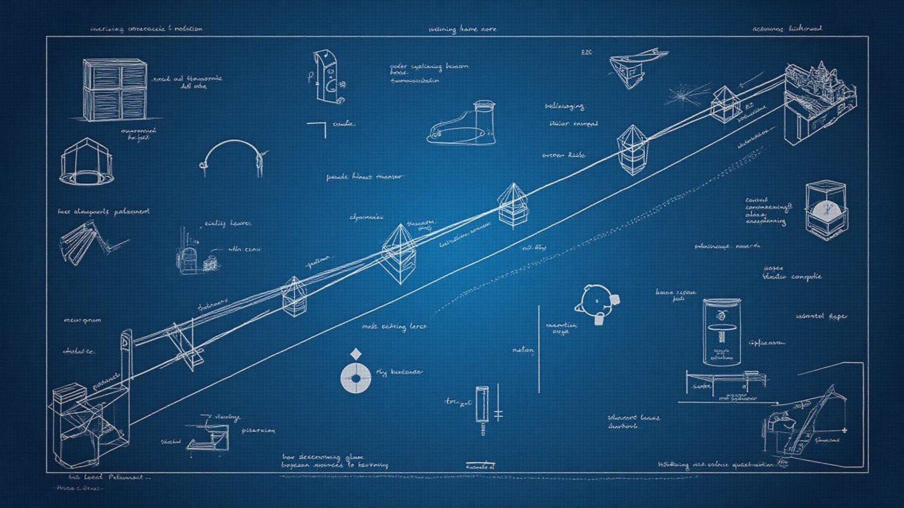

# 🕊️ Blue Pigeon - The Art of Programming Platform

<div align="center">


> *"Like a pigeon carrying essential messages across vast distances, Blue Pigeon carries the core patterns and principles needed to master programming."*

</div>

## 🎯 Revolutionary Learning Platform + Professional Cloud IDE

**Blue Pigeon** transforms programming education by combining **algorithmic thinking** with a **world-class cloud development environment**. Built in partnership with **SkillBrain** and inspired by **Harvard's CS50AI**, this isn't just another coding tutorial – it's a complete ecosystem where learning meets professional development.

### 🎨 Educational Philosophy

- **🧠 Algorithmic Intuition**: Focus on understanding patterns rather than syntax memorization
- **📋 Blueprint Mastery**: Essential programming patterns that developers can apply anywhere  
- **🔍 Pattern Recognition**: Training developers to see underlying structures in any codebase
- **🤖 AI-Era Programming**: Emphasizing conceptual understanding over memorization in an AI-driven world

---

## 💻 **THE CENTERPIECE: Professional Cloud IDE**

### 🌟 **What Makes This IDE Revolutionary**

Blue Pigeon's integrated development environment isn't just a feature – **it's a game-changer**. Students don't just read about programming; they **write, execute, and master code** in a professional-grade environment that rivals VS Code, but runs entirely in the cloud.

#### **🚀 Core IDE Capabilities**

**📁 Database-Driven File System**
- **Persistent project workspaces** that never disappear
- **Hierarchical file/folder management** with complete CRUD operations
- **Multi-project support** - organize learning into separate workspaces
- **Private file storage** with complete user isolation via Row Level Security

**✏️ Professional Code Editor** 
- **Monaco Editor integration** (same engine as VS Code)
- **Intelligent syntax highlighting** for Python, JavaScript, and more
- **Auto-completion and IntelliSense** for faster coding
- **Multi-tab interface** for working with multiple files
- **Dark/light theme support** matching the Blue Pigeon aesthetic

**▶️ Live Code Execution**
- **Run Python code instantly** in isolated cloud containers
- **Real-time output display** with professional formatting
- **Error handling and debugging** with clear feedback
- **Kubernetes-powered execution** - each user gets their own environment

**🖥️ Integrated Terminal**
- **Full bash terminal access** within the browser  
- **Linux environment** with Python, pip, and essential tools pre-installed
- **File system operations** directly from the command line
- **Package installation** and dependency management

**🔍 Advanced Features**
- **Global search** across all files and projects
- **Version control** with automatic file history
- **Auto-save system** - never lose your work
- **Collaborative potential** - ready for real-time multi-user editing

<div align="center">



*The Blueprint methodology visualized - systematic thinking patterns for mastering programming*

</div>

### ☸️ **Cloud Infrastructure Behind the IDE**

**Why This Architecture is Special:**

**🐳 Kubernetes-Powered Execution**
- Each user gets their own **isolated Python environment**
- **Ultra-lightweight Alpine Linux containers** (50MB) for cost efficiency  
- **Auto-scaling pods** that spin up in <5 seconds
- **30-minute session timeouts** with automatic cleanup
- **Cost-optimized**: Only ~$0.01-0.05 per session hour

**🗄️ Industrial-Grade Database**
```sql
🏗️ projects          - User workspaces with complete isolation
📁 file_system_items  - Hierarchical file/folder structure  
📚 file_history       - Automatic version control for every change
⏰ recent_files       - Smart access pattern tracking
👤 profiles           - Extended user management
📄 content            - Dynamic educational content system
```

**🔒 Security & Performance**
- **Row Level Security (RLS)** - Users can only see their own data
- **Optimized database indexes** for millisecond file operations
- **Automatic triggers** for path management and versioning
- **Workload Identity** for secure Kubernetes access

---

## 🎓 **Learning Paths with Hands-On Practice**

### **From Theory to Practice - The Blue Pigeon Way**

Each learning module combines **conceptual understanding** with **immediate hands-on practice** in the cloud IDE:

#### **1. 🐍 Python & AI Foundations** (`/foundations`)
**Learn:** Python fundamentals with algorithmic thinking approach  
**Practice:** Write and execute your first algorithms in the cloud IDE  
**Master:** Real-world problem-solving with immediate feedback

#### **2. 📋 Blueprint Patterns** (`/blueprints`)  
**Learn:** Essential programming patterns and data structures  
**Practice:** Implement sorting algorithms, stacks, queues in real-time  
**Master:** Pattern recognition across different programming contexts

#### **3. 🎯 Advanced Mastery** (`/blueprints-mastery`)
**Learn:** Complex algorithms and system design patterns  
**Practice:** Build scalable solutions with performance optimization  
**Master:** Professional-level coding practices and architecture

#### **4. 📊 Data Science Track**
**Learn:** Mathematical foundations and ML concepts  
**Practice:** Interactive data analysis with Python libraries  
**Master:** Build and deploy machine learning models

---

## 🏗️ **Modern Full-Stack Architecture**

### **Frontend Excellence**
- **⚛️ React 18** with TypeScript for type-safe development
- **⚡ Vite** for lightning-fast development and optimized builds  
- **🎨 Tailwind CSS** with custom Blue Pigeon design system
- **🧩 Radix UI + shadcn/ui** for accessible, beautiful components
- **🧭 React Router v6** for seamless navigation
- **🔄 React Query** for intelligent data fetching and caching

### **Backend Power**
- **🗄️ Supabase (PostgreSQL)** with real-time capabilities
- **🔐 Supabase Auth** for secure, scalable user management  
- **📡 Edge Functions** for serverless API endpoints
- **💾 Supabase Storage** for file and media management
- **🚀 Google Cloud Platform** for container orchestration

### **IDE-Specific Features**
- **📁 Real-time file synchronization** across all devices
- **🔄 Automatic backup and recovery** of all work
- **📊 Usage analytics** for learning progress tracking
- **🎨 Customizable interface** with themes and preferences
- **🔌 Extension potential** for additional tools and languages

---

## 🚀 **Getting Started with the IDE**

### **🏃‍♂️ Quick Start (2 minutes to code!)**

1. **Clone & Install**
```bash
git clone [repository-url]
cd blue-pigeon
npm install
```

2. **Configure Environment**
```bash
cp .env.example .env
# Add your Supabase credentials
```

3. **Launch the Platform**
```bash
npm run dev
```

4. **Start Coding in the Cloud** 
   - Sign up/login → Access the IDE → Start with the pre-loaded `main.py`
   - Your first Fibonacci sequence is ready to run!

### **☸️ Optional: Full Cloud IDE Setup**

For the complete Kubernetes-powered experience:

```bash
# One-command setup for macOS/Linux
chmod +x setup-terminal-platform-mac.sh
./setup-terminal-platform-mac.sh --project YOUR_PROJECT_ID
```

This automatically configures:
- ✅ Google Cloud Platform integration
- ✅ Kubernetes cluster with cost optimization
- ✅ Container registry and images
- ✅ Security and networking
- ✅ Auto-scaling and cleanup policies

---

## 📊 **IDE Performance & Cost Metrics**

### **⚡ Lightning-Fast Performance**
- **Container startup**: < 5 seconds
- **File operations**: < 100ms response time
- **Code execution**: Instant feedback
- **Synchronization**: Real-time across all devices

### **💰 Cost-Optimized for Scale**
- **Ultra-lightweight containers**: 50MB Alpine Linux base
- **Smart resource limits**: 50m CPU, 128Mi RAM per session
- **Auto-cleanup**: 30-minute session timeouts  
- **Scale-to-zero**: $0 cost when inactive
- **Estimated cost**: $0.01-0.05 per hour per active user

---

## 📁 **Project Architecture**

```
blue-pigeon/
├── 🎨 src/
│   ├── 📄 pages/
│   │   ├── IDEPage.tsx              # ⭐ THE STAR - Full cloud IDE
│   │   ├── LandingPage.tsx          # Platform introduction
│   │   ├── Foundations.tsx          # Python & AI fundamentals
│   │   ├── Blueprints.tsx           # Programming patterns
│   │   └── ...ML & Data tracks
│   ├── 🧩 components/
│   │   ├── AuthContext.tsx          # User authentication
│   │   ├── ContentProvider.tsx      # Dynamic content system
│   │   └── ui/                      # Design system components
│   ├── 🎣 hooks/
│   │   └── useExplorer.ts           # IDE file management logic
│   └── 🔧 services/
│       └── explorerService.ts       # Database operations
├── ☸️ Infrastructure/
│   ├── k8s-config.yaml              # Kubernetes manifests
│   ├── Dockerfile.python-terminal   # Container definition
│   └── setup-terminal-platform.sh  # One-click setup
└── 🗄️ supabase/
    ├── migrations/                  # Database schema
    └── functions/                   # Cloud functions
```

---

## 🎨 **Visual Design Philosophy**

### **Color Psychology**
- **Python Blue** (#306998): Trust, stability, professionalism  
- **Python Gold** (#FFD43B): Energy, creativity, innovation
- **Blue Pigeon Gradients**: Seamless flow between learning concepts

### **Responsive & Accessible**
- **Mobile-first design** for learning on any device
- **High contrast ratios** for accessibility compliance  
- **Smooth animations** that guide attention without distraction
- **Dark/light themes** that adapt to user preferences

---

## 🤝 **Partnerships & Recognition**

### **🧠 SkillBrain Collaboration**
Educational expertise meets technical innovation in curriculum design.

### **🎓 Harvard CS50AI Inspiration**  
Following proven pedagogical methods adapted for practical development.

### **💝 Built with Lovable**
Rapid prototyping platform enabling quick iteration and deployment.

---

## 📜 **Development Commands**

```bash
# Core Development
npm run dev          # Start development server with hot reload
npm run build        # Production build for deployment  
npm run preview      # Preview production build locally
npm run lint         # Code quality checking with ESLint

# IDE-Specific
npm run setup:k8s    # Initialize Kubernetes infrastructure
npm run deploy:ide   # Deploy IDE container images
npm run test:ide     # Run IDE integration tests
```

---

## 🎯 **What Makes This Special**

**🚀 For Students**: Learn programming through hands-on practice in a professional environment  
**💻 For Educators**: Provide real development tools without setup complexity  
**🏢 For Institutions**: Scalable, secure, cost-effective cloud infrastructure  
**🌍 For Everyone**: Access a full development environment from any browser, anywhere

**Blue Pigeon doesn't just teach programming – it teaches programmers how to think, build, and create in the modern cloud-native world.**

---

<div align="center">

**🕊️ Blue Pigeon - Carrying the essential patterns of programming across the vast landscape of technology 💙**

*Where education meets professional development in the cloud*

**[Start Coding Now](/) • [View IDE Demo](/) • [Explore Curriculum](/)**

</div>